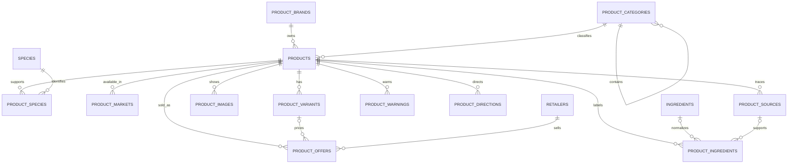

# Unified product catalog

The catalog separates a product identity from its species suitability, country availability, variants, retailer offers, label facts, and source records. One catalog was chosen so adding a species or country is a data operation rather than a schema redesign.

## Representation

- `products` holds the stable product identity. Package size, format, flavor, quantity, and formula choices belong in `product_variants`.
- `species` is an extensible reference table. `product_species` records intended, compatible, or restricted suitability and permits one product to support several species.
- `product_markets` records country availability independently from product identity. Public queries require an available market for the selected ISO country code.
- `retailers` are reusable identities. Prices and outbound URLs belong to country-specific `product_offers`; prices use PostgreSQL `numeric`, and the domain layer exposes them as decimal strings.
- `product_sources` preserves provider, retrieval, hash, and raw source material. Normalized tables power application search. Source rows and raw payloads are not client-readable.
- Label ingredients remain verbatim in `product_ingredients.label_name`. `ingredients` is only linked when a future importer can confidently map a canonical ingredient.

## Writing catalog data

Trusted server or administrative processes should upsert identities by stable slugs or provider external IDs, then write relationships and source-linked facts in one controlled job. Never use a publishable client key for writes. Keep manufacturer warnings and directions unchanged in storage. Set market availability only when the source supports it, and set `last_verified_at` only after a real verification.

The current curated records are seeded with `node --env-file=.env.local scripts/seed-catalog.mjs` after applying the migration. The command requires `NEXT_PUBLIC_SUPABASE_URL` and `SUPABASE_SECRET_KEY` (the legacy `SUPABASE_SERVICE_ROLE_KEY` name is also accepted). It is repeatable: brands, products, variants, markets, offers, and sources use stable conflict keys, while source-linked label facts are refreshed for the same curated source.

To add a species, insert a lowercase code into `species` and connect products through `product_species`. To add a retailer, upsert `retailers`, then add country-specific `product_offers`. Neither operation requires a new application table.

## Compatibility rollout

The Products page and product-advice routes read through `app/lib/catalog`. The former TypeScript catalog remains only as an error fallback while the database seed is verified; an empty database result does not activate it. Remove this fallback with the legacy `MockProduct` adapter after deployment verification.

## Deferred work and scaling risks

Deferred work includes large-scale ingestion, affiliate feeds, automated price refresh, product embeddings, recommendation ranking, saved and recently viewed products, and review aggregation.

The schema is a foundation, not a claim of full production scale. Remaining risks include connection pooling and server connection strategy, query-plan measurement as tables grow, response and edge caching, a dedicated search service if deterministic PostgreSQL search stops meeting latency goals, ingestion throughput and retry design, external image reliability and hosting policy, and scheduling retailer price-refresh workloads without overwhelming providers or the database.
