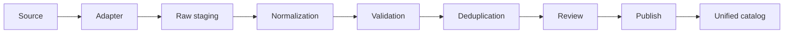

# Product ingestion

Product ingestion is a trusted, server-only workflow that keeps source rows in staging until a person explicitly approves publication. It writes to the unified catalog from Step 2 and does not create a second live catalog.



## Lifecycle

A batch moves through `uploaded`, `parsing`, `validating`, `ready_for_review` or `partially_valid`, `approved`, `publishing`, and `published`. Error and operator states are `failed`, `rejected`, and `cancelled`.

Records use `pending`, `parsed`, `valid`, `valid_with_warnings`, `invalid`, `possible_duplicate`, `approved`, `rejected`, `published`, and `failed`. Raw JSON is immutable. Normalized JSON can be regenerated or corrected during review. Audit events are append-only.

Only approved records in an approved batch can publish. A record failure does not stop later records. Any failure leaves the batch in `failed` with accurate published and failed counts so failed records can be retried.

## Adapter contract

Each `ProductIngestionAdapter` declares a provider and source type and converts input into `ParsedIngestionRecord[]`. Each parsed record contains a row number and `RawIngestionProduct`. CSV, JSON, and internal-curated adapters are included. API and feed adapters should implement the same interface without putting provider logic in catalog queries.

Required publishable fields are product name, brand name, at least one configured species, at least one valid ISO country, and a category that has been mapped before approval. Optional fields include images, ingredients, directions, warnings, prices, GTIN, and manufacturer codes. Their absence creates warnings rather than automatic rejection.

Limits are configurable in `catalog-ingestion/constants.ts`: 5 MB per file, 5,000 records per batch, 64 KB per CSV field, 10,000 characters for large text, 12 images, 50 variants, 50 offers, 500 ingredients, 100 warnings, and 100 directions per product. Database writes use chunks of 200 staging records.

## Normalization and validation

Normalization trims whitespace, normalizes species, country and currency casing, produces stable slugs, maps availability values, and parses only confident size patterns. Original size text, ingredient labels, descriptions, warnings, and directions remain available. It does not infer missing ingredients, species, markets, or verification.

Category aliases are centralized in `category-mapping.ts`. Examples include `Dog Shampoo` to Grooming and Shampoo, and `Dry Adult Dog Food` to Food and Dry Food. Unknown categories stay in staging with an `unmapped_category` warning and must be corrected before approval.

Species aliases are centralized in `species-mapping.ts`. Reliable values such as dogs, canine, cats, and feline map to dog or cat. Missing or unsupported values are errors. Vague product names are not used to guess species.

Public source and offer URLs must use HTTP or HTTPS. Product images require HTTPS and reject obvious placeholders, tracking pixels, duplicates, and multiple primary images. Validation never fetches URLs. JavaScript, data, and file protocols are rejected. Future fetchers must separately enforce DNS and address controls against server-side request forgery.

Validation issues are stored as arrays of `{ field, code, message }`. Errors block approval. Warnings preserve reviewable gaps such as missing images, label details, prices, availability, GTIN, or manufacturer code. CSV cells that begin with spreadsheet formula characters are preserved and flagged for safe escaping in any future exports.

## Duplicate detection and idempotency

Exact signals are GTIN, provider plus external ID, manufacturer code within a brand, and retailer external ID. Exact matches propose an update. Matching brand, name, size, slug, source URL, or image can produce probable or possible matches; these require manual resolution and never merge automatically.

SHA-256 hashes are calculated over stable raw and normalized JSON. An unchanged provider record proposes `skip`, avoiding catalog writes and product-update events. Hashes supplement rather than replace identity signals.

Brands, sources, species links, markets, variants, and offers use stable conflict keys. Images and source wording are checked before insertion. Repeated publication adds no duplicate relationships. Existing product IDs are retained for approved updates.

## Trust and publication

Trust precedence is:

1. Internal manual override
2. Manufacturer
3. Trusted distributor
4. Structured retailer feed
5. Retailer page
6. Unverified third-party feed

Trust is applied by field. Internal and manufacturer sources may update official names and label facts. Trusted classification sources may update category and species assignments after review. Retail sources control their own offer URL, price, and availability. Missing incoming fields never erase populated catalog fields. Missing prices do not become zero, missing images and label facts do not delete existing values, and unknown availability preserves a known offer state.

New products are created as inactive drafts and become active only after their relationships and provenance have been written. Updates use the existing product ID and only add or update allowed fields. Price changes update the stable offer and create an audit event with old and new values. The current CLI uses idempotent per-record writes rather than a single database transaction; draft-first visibility and retries make new-record failures safe, while a future database worker transaction remains desirable for stronger atomicity on complex updates.

## Secure operation

There is no existing Furvise administrator role or secure admin interface, so this step provides a CLI instead of an admin page or hidden route. Preview needs no credentials. Every database operation requires `NEXT_PUBLIC_SUPABASE_URL` and `SUPABASE_SECRET_KEY` in the server process; the legacy `SUPABASE_SERVICE_ROLE_KEY` name is also accepted. Staging tables have RLS enabled and no client policies. Never place the server-secret value in `NEXT_PUBLIC_*`, browser code, logs, or committed files.

Preview files:

```powershell
npm.cmd run catalog:ingest -- preview csv path\products.csv provider_name
npm.cmd run catalog:ingest -- preview json path\products.json provider_name
```

Stage and review:

```powershell
node --env-file=.env.local scripts/catalog-ingestion.mjs stage csv path\products.csv provider_name csv
node --env-file=.env.local scripts/catalog-ingestion.mjs list
node --env-file=.env.local scripts/catalog-ingestion.mjs summary BATCH_ID
node --env-file=.env.local scripts/catalog-ingestion.mjs inspect RECORD_ID
node --env-file=.env.local scripts/catalog-ingestion.mjs resolve RECORD_ID create
node --env-file=.env.local scripts/catalog-ingestion.mjs replace-normalized RECORD_ID corrected.json
node --env-file=.env.local scripts/catalog-ingestion.mjs approve BATCH_ID RECORD_ID REVIEWER "Reason"
node --env-file=.env.local scripts/catalog-ingestion.mjs reject BATCH_ID RECORD_ID "Reason"
node --env-file=.env.local scripts/catalog-ingestion.mjs approve-batch BATCH_ID
node --env-file=.env.local scripts/catalog-ingestion.mjs publish BATCH_ID
node --env-file=.env.local scripts/catalog-ingestion.mjs retry BATCH_ID
```

To add a provider, implement the adapter interface, preserve the untouched source object in `rawPayload`, enforce the shared limits, and pass the common shape through the same normalization, validation, duplicate review, and publication path.

## Provider 001

The first real-source workflow is documented in [product-provider-001.md](./product-provider-001.md). It uses a strict reviewed Purina Canada identity CSV. Current rows are intentionally blocked from publication because commercial source-use permission is unresolved; this is a successful safety-gate outcome, not permission to bypass the gate.

## Authorized catalog readiness

The provider-neutral authorized-feed contract, private upload workflow, disabled Impact readiness module, field permissions, and freshness handling are documented in [authorized-catalog-ingestion.md](./authorized-catalog-ingestion.md). The commercial and technical approval sequence is in [provider-onboarding-checklist.md](./provider-onboarding-checklist.md). These capabilities do not authorize or activate any provider by themselves.

The launch-safe, non-affiliate manual workflow is documented in [organic-curated-catalog.md](./organic-curated-catalog.md). Its per-record permission snapshots, CA/US isolation, product-class safety requirements, and prohibition on affiliate/unsourced commerce data are enforced in addition to the existing review and publication gates.

## Deferred scaling work

This foundation is deliberately bounded and synchronous. Large feed operations still need background jobs, durable message queues, controlled worker concurrency, database connection pooling, bulk `COPY` staging, object storage for source files, provider rate-limit handling, asynchronous search indexing, metrics and tracing, dead-letter processing, scheduled feed refreshes, and a price-refresh policy. Those are required before claiming million-record ingestion capacity.
